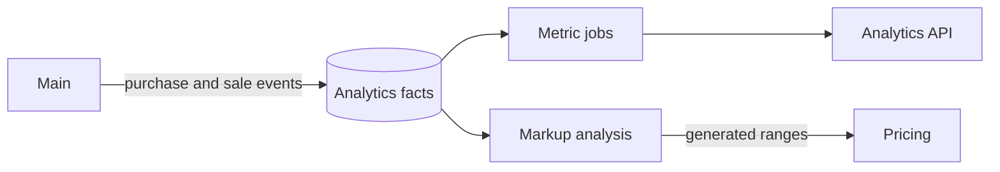

# Analytics Service

Analytics builds independent reporting facts from Main events and calculates reusable business metrics in background
jobs.

## What It Does

- synchronizes completed purchase and sale facts from Main;
- removes facts when their source operation is deleted or no longer completed;
- calculates product purchase and sales metrics for a date range;
- tracks metric recalculation jobs and publishes live status updates;
- analyzes historical sale margins and generates markup ranges for Pricing.

## Data Flow

The current product metrics return total quantity and amount plus minimum, maximum, average, and price volatility.
Metrics are marked for recalculation when relevant facts change; Analytics Worker schedules unique long-running jobs to
refresh them.

Markup analysis groups historical sales by purchase cost and publishes the mean markup for each range. Pricing consumes
these ranges as an auto-generated markup group. See [PRICING.md](PRICING.md).

## API

| Endpoint | Purpose |
| --- | --- |
| `GET /analytics/metrics/info` | List available metric types and their inputs. |
| `GET /analytics/metrics` | Return configured metrics and results. |
| `POST /analytics/metrics` | Create a metric or return the existing equivalent. |
| `GET /analytics/metrics/{id}/jobs` | Return calculation jobs for a metric. |

Exact schemas and permissions are available at <http://localhost:8080/docs>. Job progress is also published through
SignalR hubs.

## Current Scope

The implemented metrics cover product purchases and sales. Price forecasting, recommendations, supplier price history,
and ABC/XYZ analysis remain roadmap items in [TODO.md](TODO.md).

