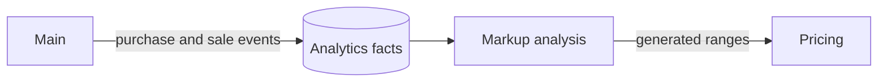

# Analytics Service

Analytics builds independent reporting facts from Main events and analyzes historical data for other services.

## What It Does

- synchronizes completed purchase and sale facts from Main;
- removes facts when their source operation is deleted or no longer completed;
- analyzes historical sale margins and generates markup ranges for Pricing.

## Data Flow

```mermaid
flowchart LR
    Main -->|purchase and sale events| Facts[(Analytics facts)]
    Facts --> Markup[Markup analysis]
    Markup -->|generated ranges| Pricing
```

Markup analysis groups historical sales by purchase cost and publishes the mean markup for each range. Pricing consumes
these ranges as an auto-generated markup group. See [PRICING.md](PRICING.md).

## Current Scope

The legacy product metrics implementation has been removed and will be replaced by the segmented analytics model.
Price forecasting, recommendations, supplier price history, and ABC/XYZ analysis remain roadmap items in
[TODO.md](TODO.md).
