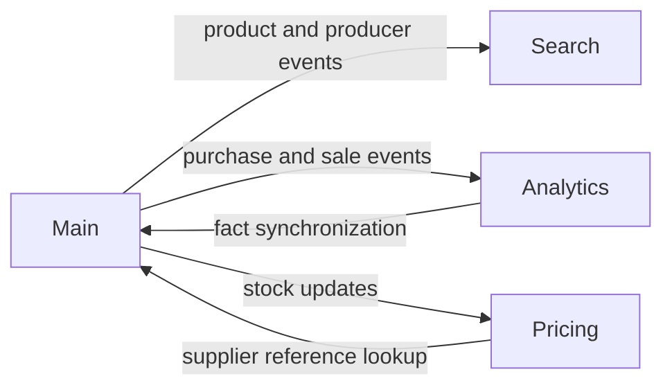

# Main Service

Main owns the core business data and operations. Warehouse functionality is described separately in [WMS.md](WMS.md).

## What It Does

- manages products, producers, aliases, characteristics, dimensions, weights, images, and product relations;
- maps supplier producer/SKU references to the internal catalog;
- handles users, authentication, roles, permissions, contacts, discounts, and financial profiles;
- processes carts, purchases, sales, balances, and transactions;
- manages currencies and exchange-rate history;
- stores uploads and product media in S3-compatible storage;
- runs CSV imports for products, producers, aliases, crosses, and supplier mappings;
- provides internal APIs used by Pricing, Search, and Analytics.

## Main Areas

| Prefix | Purpose |
| --- | --- |
| `/main/products` | Catalog, stock summary, properties, media, relations, and reservations. |
| `/main/producers` | Producers, aliases, and supplier mappings. |
| `/main/users` | Users, roles, permissions, contacts, discounts, and assigned warehouses. |
| `/main/auth` | Registration, login, token refresh, password recovery, and email confirmation. |
| `/main/cart` | User cart operations. |
| `/main/purchases` | Purchases and incoming stock. |
| `/main/sales` | Sales and outgoing stock. |
| `/main/transactions` | Balance transactions and reversals. |
| `/main/currencies` | Currencies, rates, and rate history. |
| `/main/uploads` | Upload requests and completion. |

Exact schemas and permissions are available at <http://localhost:8080/docs>.

## Service Integration

Main publishes changes through RabbitMQ instead of sharing its database. Search updates indexes, Analytics synchronizes
facts, and Pricing rebuilds internal offers from these events.

## Background Work

Main Worker processes email and long-running jobs. Current import jobs accept CSV data for catalog and supplier mapping
operations, while currency-rate and catalog synchronization jobs support scheduled maintenance.

See [TODO.md](TODO.md) for planned supplier-driven catalog enrichment and automatic suggestions.

