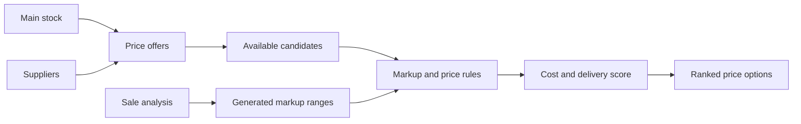

# Pricing and Markup

Pricing converts supplier offers and company stock into ranked sale-price options for a product and target warehouse.

## What It Does

- receives internal-stock offers from Main;
- requests and stores supplier offers;
- resolves supplier SKUs and producers through Main;
- applies markup and source-specific price rules;
- ranks options by cost and delivery time;
- converts the result into the requested currency;
- recalculates stale options in background jobs.

## Price Flow



Supplier prices are calculated first and form the market reference for internal stock. Internal prices cannot fall below
the supplier reference cost and receive an extra markup when no supplier market exists. Every price is rounded to the
configured step.

Options are ranked by effective cost:

```text
effective cost = purchase cost + average delivery days × delivery-day penalty
score = 1 / effective cost
```

## Markups

A markup group contains cost ranges and a proportional markup for each range. Groups can be:

- created manually through `/pricing/markups`;
- generated by Analytics from historical sale margins.

Pricing uses the selected manual group or the newest generated group. If no range matches, it uses `DefaultMarkup`.
Currency-rate or markup changes reload ranges and enqueue recalculation of options with an old markup version.

## Main Settings

| Setting | Purpose |
| --- | --- |
| `SelectedMarkupId` | Selects the active markup group. |
| `DefaultMarkup` | Fallback markup. |
| `OfferTtl` | Supplier-offer lifetime. |
| `PriceRoundingStep` | Final rounding step. |
| `DeliveryDayPenalty` | Delivery penalty used during ranking. |
| `UniqProductAdditionalMarkup` | Extra markup when no supplier market exists. |

`PricingStrategy` is stored in settings but is not yet used by the current calculator.

## API

| Endpoint | Purpose |
| --- | --- |
| `GET /pricing/offers` | Refresh and return ranked price options. |
| `GET /pricing/markups` | Return markup groups. |
| `POST /pricing/markups` | Create or update a markup group. |

Exact schemas and permissions are available at <http://localhost:8080/docs>.

## Current Scope

Favorit participates in the runtime supplier pipeline. Armtek has client infrastructure but is not fully connected yet.
Analytics price recommendations and real-time supplier-calendar logistics remain roadmap items in [TODO.md](TODO.md).
