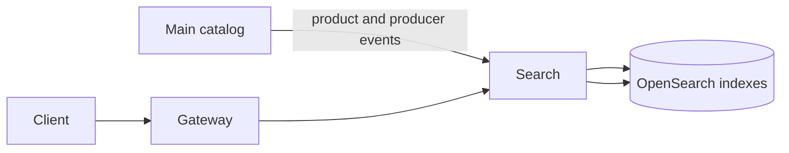

# Search Service

Search provides product and producer discovery through OpenSearch. Main remains the source of truth for catalog data.

## What It Does

- searches products by name and SKU;
- supports exact, prefix, substring, and fuzzy SKU matching;
- filters products by producer and dimensions;
- supports pagination and configured sorting;
- searches producers by primary name and aliases;
- returns producer aliases;
- updates or deletes search documents after Main integration events.

## Data Flow

Product documents include catalog information, producer data, stock, dimensions, and weight. Indexes are created lazily
when first used. Main also contains synchronization jobs for rebuilding product and producer documents.

## API

| Endpoint | Purpose |
| --- | --- |
| `GET /search/products/all` | Search by name/SKU with producer and dimension filters. |
| `GET /search/products/sku` | SKU-focused search with an optional producer filter. |
| `GET /search/producers` | Search producers by name or alias. |
| `GET /search/producers/{id}/aliases` | Return producer aliases. |

Exact query parameters and permissions are available at <http://localhost:8080/docs>.

## Current Scope

Dedicated suggestions, transliteration, and supplier-producer names awaiting confirmation are not yet included. See
[TODO.md](TODO.md).

