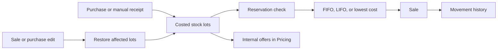

# Warehouse Management in Main

Main contains warehouse-level inventory management: stock receipt, storage, reservation, sale, return, and logistics.

## What It Does

- manages company warehouses and supplier storage locations;
- tracks stock as costed lots with quantity, currency, purchase price, and receipt date;
- processes purchases, sales, and manual stock adjustments;
- supports product reservations and protects stock reserved by other users;
- writes movement history for inventory changes;
- calculates delivery costs between warehouses;
- publishes stock updates to Pricing.

## Stock Flow

Stock is kept in separate lots, so a sale retains its real purchase cost and can be restored correctly after editing or
deletion. Lot selection is configurable:

- FIFO — oldest stock first;
- LIFO — newest stock first;
- lowest base-currency cost first.

If the selected warehouse has insufficient stock, an operation may optionally continue from other warehouses. Updates
use row locking and optimistic concurrency to prevent conflicting quantity changes.

## Logistics

Routes connect two warehouses and define delivery time, currency, carrier, minimum charge, and a pricing model. Delivery
can be free, charged per order, volume, weight, or a combination of volume and weight.

`POST /main/logistics/calculate` calculates delivery cost from product dimensions and weights over an active direct
route.

## API Areas

| Prefix | Purpose |
| --- | --- |
| `/main/storages` | Warehouses, stock, and owners. |
| `/main/storages/routes` | Warehouse delivery routes. |
| `/main/logistics/calculate` | Delivery-cost calculation. |
| `/main/purchases` | Incoming stock operations. |
| `/main/sales` | Outgoing stock operations. |
| `/main/products/reservations` | Product reservations and their history. |

Exact request schemas and permissions are available at <http://localhost:8080/docs>.

## Pricing Integration

Every stock change publishes the current product quantity and purchase cost. Pricing consumes these events and updates
the company's internal offers without accessing the Main database directly.

## Current Scope

The implementation manages inventory at warehouse and lot level. Bin locations, picking, packing, shipment tracking,
and route optimization are not currently included.
